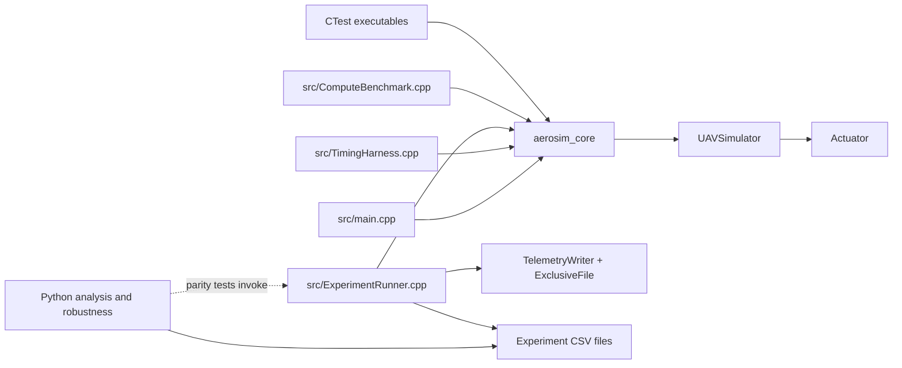

# Architecture and behavior

This guide describes the implementation in the repository. It is a software simulation architecture, not a validated aerodynamic model.

## Component map

`aerosim_core` contains `UAVSimulator` and `Actuator`; the other executables compose that library for interactive output, desktop timing, compute benchmarking, or CSV experiments. C++ tests link to the core library. Python analysis consumes experiment CSV files. The parity tests invoke the compiled C++ experiment runner and compare matched default scenarios against Python-generated values.

## State and kinematic update

`UAVState` contains simulation time, X position, Y position, altitude coordinate, and forward speed. The default initial state is:

| Field | Initial value | Meaning in this implementation |
| --- | ---: | --- |
| Time | 0 s | Elapsed simulation time |
| X | 0 m | Forward position |
| Y | 0 m | Sideways position; held constant |
| Altitude | 100 m | Altitude coordinate initialized to 100 m; datum is unspecified and the value is held constant |
| Forward speed | 20 m/s | Constant forward speed |

`UAVSimulator::time_step` is `0.01` seconds. Each call to `step()` advances X by `forward_speed * time_step`, leaves Y, altitude, and forward speed unchanged, and advances simulation time by one step. The core does not derive forces, attitude, climb, turns, or aerodynamic response. It should be described as a simple deterministic kinematic model, not as realistic flight dynamics.

## Actuator and injected fault

The actuator is a scalar software position model. Its default position range is `[-1, 1]`, and its default maximum movement rate is `2 position units/second`. Commands are clamped to the configured range. On an ordinary update, actual position moves toward the clamped command by no more than `rate_limit * dt`. Constructor/configuration values, commands, and update time steps are checked for finite values; bounds must be ordered, rate nonnegative, and update time nonnegative. Invalid input follows the C++ API's exception convention.

Fault settings are supplied separately from the update operation. The simulator uses **simulation time** to activate the configured stuck-actuator fault. For a positive activation time, each step updates the actuator, advances simulation time, and then checks whether the configured time has been reached; the fault therefore becomes active at the end of the first step at or beyond that time, and the corresponding telemetry record is marked active. The actuator freezes at its then-current actual position. Later command values may change, but actual position remains frozen. A fault configured at time zero is active from initialization. The model assumes an ideal instantaneous freeze and is not a hardware actuator or fault-physics model.

## Experiment and telemetry path

`aerosim_experiments` runs two seconds at 100 Hz for a nominal scenario and a fault-injected scenario, using matching initial state and command schedule. The command starts at `0.8` and changes to `-0.4` at simulation time `0.5 s`; the fault activation time is a CLI option. Each CSV stores one record after each simulation step (200 data rows), so the first record is at `0.01 s`, not `0 s`.

`TelemetryWriter` owns CSV serialization and schema validation. `ExclusiveFile` creates destination files exclusively, preventing an existing file from being truncated. The runner writes `experiment_complete.txt` only after both telemetry writers have closed successfully. A failure can leave partial CSV data; absence of a valid completion marker means consumers must treat the pair as incomplete. The Python analysis currently consumes CSV paths and does not itself require or validate that marker. Full schema and output semantics are in [Telemetry](../TELEMETRY.md).

## Python analysis boundary

`python/anomaly_analysis.py` trains an Isolation Forest from the first 80% of nominal telemetry only; the final nominal portion is used to estimate nominal false-positive behavior. The full fault-run labels are held for evaluation. Features include actuator command, actual actuator position, command-minus-position tracking error, and one-step actuator position change. Simulation time and `actuator_fault_active` are excluded from features.

The rule-based stuck detector is separate from Isolation Forest. It combines nominal-derived tracking-error/movement thresholds with a persistence requirement. The robustness evaluator uses deterministic Python-generated scenario variants. Parity tests validate the matching C++ experiment-runner schedules, but not every generated scenario command schedule. Both detectors and the generated cases are experimental software analysis, not flight-tested monitoring.
